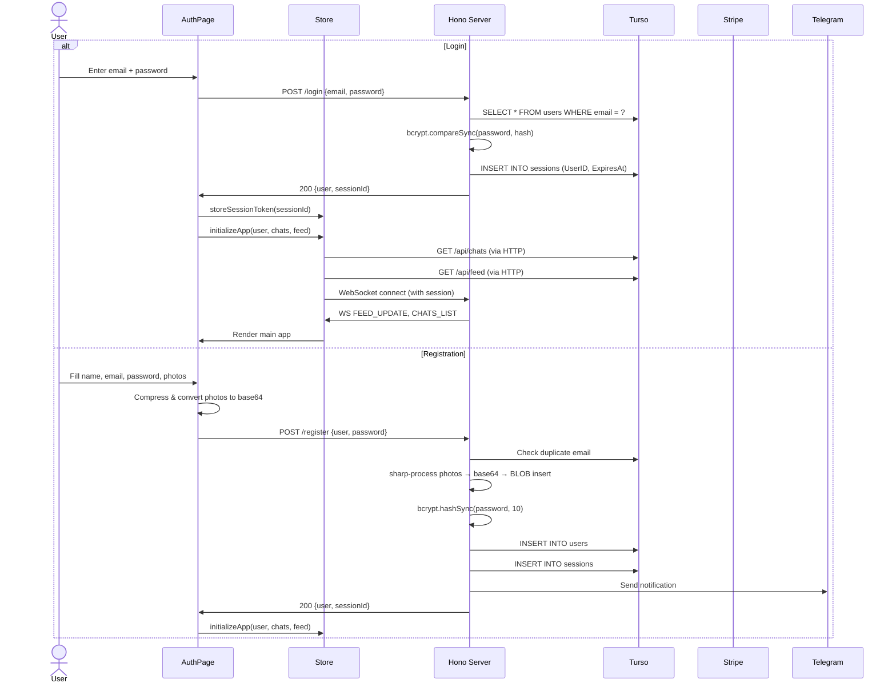
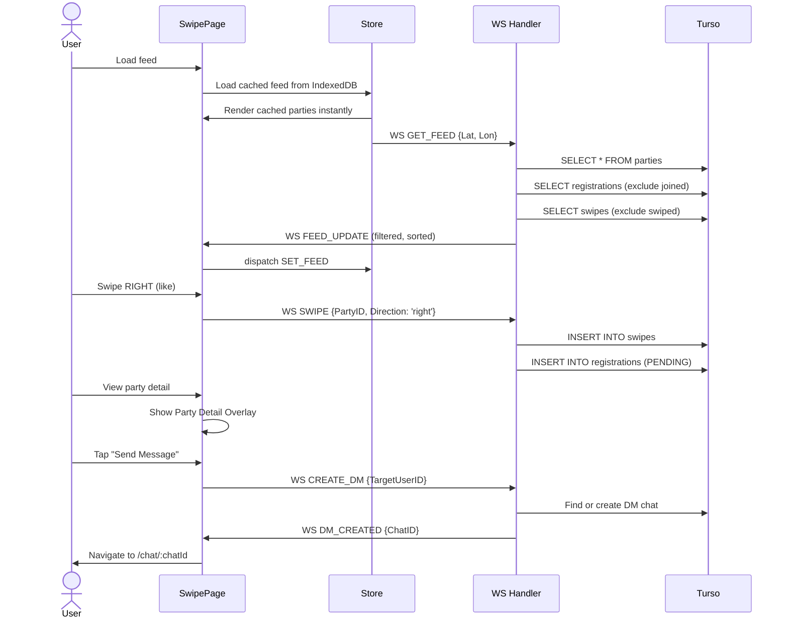
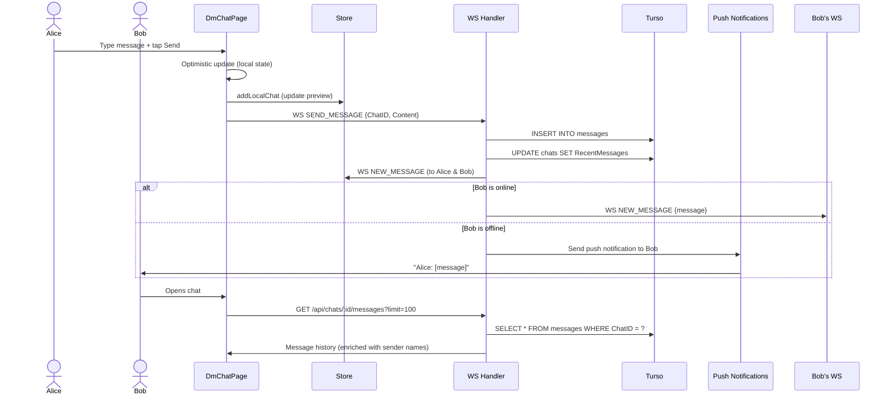
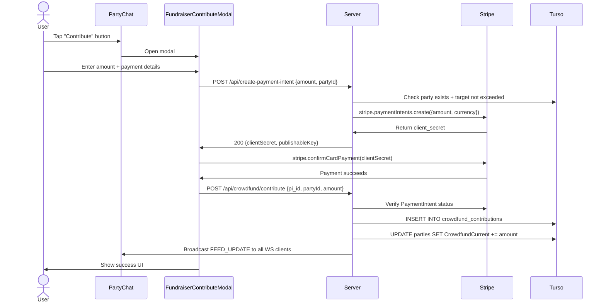
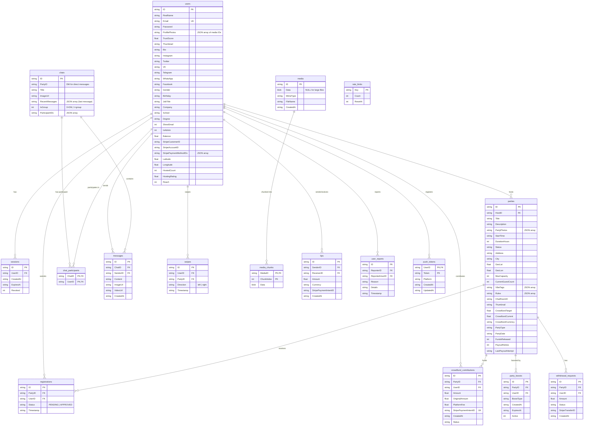
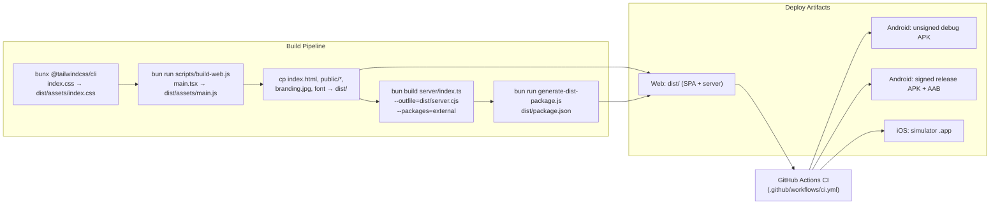

# WaterParty Architecture Diagrams

> Mermaid.js diagrams documenting the full architecture of the WaterParty app.
> Generated from the live codebase — June 2026.

---

## 1. System Context (C4 Level 1)

```mermaid
graph TB
  title System Context — WaterParty

  User("User")
  subgraph "WaterParty App"
    WP("React SPA + Hono Server")
  end
  subgraph "External Services"
    TURSO("Turso/libSQL")
    STRIPE("Stripe")
    ADMOB("AdMob")
    TELEGRAM("Telegram Bot")
    PUSH("Push Notifications")
    LEAFLET("Leaflet / Nominatim")
  end

  User -->|"Uses via browser or native app"| WP
  WP -->|"Reads/writes data"| TURSO
  WP -->|"Payment processing, payouts, tips"| STRIPE
  WP -->|"Interstitial & rewarded ads"| ADMOB
  WP -->|"Admin alerts"| TELEGRAM
  WP -->|"FCM/APNs"| PUSH
  WP -->|"Map tiles & geocoding"| LEAFLET
```

---

## 2. Frontend Architecture

```mermaid
graph TB
  subgraph "React App (src/)"
    ENTRY["main.tsx (ReactDOM.createRoot)"]
    APP["App.tsx (Root)"]
    STORE["Store.tsx (Context + useReducer)"]
    ROUTER["React Router"]

    ENTRY --> APP

    subgraph "Providers (outer → inner)"
      direction LR
      P1["BrowserRouter"]
      P2["ThemeProvider"]
      P3["ToastProvider"]
      P4["StoreProvider"]
    end

    APP --> P1 --> P2 --> P3 --> P4

    subgraph "Pages"
      AUTH["AuthPage"]
      SWIPE["SwipePage"]
      MESSAGES["MessagesPage"]
      CHAT["ChatRoomPage → PartyChatPage / DmChatPage"]
      CREATE["CreatePartyPage"]
      PROFILE["ProfilePage"]
      WALLET["WalletPage"]
      ADMIN["AdminDashboard"]
      PRIVACY["PrivacyPage"]
    end

    subgraph "Components"
      BOTTOM_NAV["BottomNav"]
      PHOTO_CAR["PhotoCarousel"]
      CHAT_INPUT["ChatInputBar"]
      CHAT_LIGHTBOX["ChatLightbox"]
      USER_CARD["UserProfileCard"]
      SOCIAL_ICONS["SocialIcons"]
      PHOTO_EDITOR["PhotoEditor"]
      CAMERA_CAP["CameraCapture"]
      TIP_MODAL["TipModal"]
      FUNDRAISER["FundraiserContributeModal"]
      REPORT_MODAL["ReportUserModal"]
      VIDEO_CARD["VideoCard"]
      CAROUSEL["Carousel"]
    end

    subgraph "Hooks"
      HK_CHAT["useChatRoom"]
      HK_CAMERA["useCamera"]
      HK_ADMOB["useAdMob"]
      HK_BACK["useBackButton"]
      HK_PUSH["usePushNotifications"]
      HK_TOAST["useToast"]
    end

    subgraph "Lib"
      LIB_CONSTANTS["constants.ts (API, session, cache)"]
      LIB_STORE["Store.tsx (state management)"]
      LIB_TYPES["types.ts (User, Party, Chat, Message)"]
      LIB_UTILS["utils.ts (cn, upload, compress)"]
      LIB_SANITIZE["sanitize.ts (XSS prevention)"]
      LIB_THEME["theme.ts (design tokens)"]
      LIB_THEME_CTX["ThemeContext.tsx (dark/light)"]
      LIB_CAPACITOR["capacitor.ts (native API wrappers)"]
      LIB_LOGGER["logger.ts (env-aware logging)"]
      LIB_CACHE["cache.ts (IndexedDB layer)"]
      LIB_INDEX["index.ts (barrel re-exports)"]
    end

    ROUTER --> AUTH
    ROUTER --> SWIPE
    ROUTER --> MESSAGES
    ROUTER --> CHAT
    ROUTER --> CREATE
    ROUTER --> PROFILE
    ROUTER --> WALLET
    ROUTER --> ADMIN
    ROUTER --> PRIVACY

    SWIPE --> PHOTO_CAR
    SWIPE --> USER_CARD
    SWIPE --> CAROUSEL

    CHAT --> HK_CHAT
    HK_CHAT --> CHAT_INPUT
    HK_CHAT --> CHAT_LIGHTBOX
    HK_CHAT --> VIDEO_CARD
    HK_CHAT --> REPORT_MODAL
    HK_CHAT --> CAMERA_CAP
    CHAT --> USER_CARD

    CREATE --> PHOTO_EDITOR
    CREATE --> CAMERA_CAP

    PROFILE --> PHOTO_CAR
    PROFILE --> PHOTO_EDITOR
    PROFILE --> SOCIAL_ICONS

    MESSAGES --> BOTTOM_NAV
    SWIPE --> BOTTOM_NAV
    PROFILE --> BOTTOM_NAV

    TIP_MODAL --> STORE
    FUNDRAISER --> STORE
    REPORT_MODAL --> STORE

    APP --> HK_BACK
    APP --> HK_PUSH
    APP --> HK_ADMOB
    APP --> HK_TOAST

    STORE --> LIB_CONSTANTS
    STORE --> LIB_TYPES
    PAGES --> LIB_UTILS
    PAGES --> SOCIAL_ICONS
    PAGES --> USER_CARD
    PAGES --> PHOTO_CAR
    PAGES --> PHOTO_EDITOR
    PAGES --> CAMERA_CAP
  end

  style ENTRY fill:#1a1a2e,stroke:#00d2ff
  style STORE fill:#1a1a2e,stroke:#ff3b5c
```



---

## 3. Backend Architecture

```mermaid
graph TB
  subgraph "Hono Server (server/)"
    ENTRY["index.ts (Hono + Bun serve)"]
    DB["db.ts (Turso client + migrations)"]
    HELPERS["helpers.ts (data enrichment)"]
    CONFIG["config.ts (env loader)"]
    STRIPE["stripe-init.ts"]
    TELEGRAM["telegram.ts"]
    PUSH["push.ts"]

    subgraph "Middleware"
      SESSION["session.ts (cookie + x-session-token)"]
      RATE_LIMIT["rate-limiter.ts (Turso-backed)"]
    end

    subgraph "HTTP Routes"
      AUTH["POST /login"]
      REGISTER["POST /register"]
      LOGOUT["POST /api/logout"]
      DELETE_ACCT["DELETE /api/account"]
      USERS["GET /api/users/:id"]
      PARTIES_1["GET /api/feed"]
      PARTIES_2["GET /api/party/:id"]
      PARTIES_3["GET /api/parties?ids="]
      CHATS_1["GET /api/chats"]
      CHATS_2["POST /api/chats/dm"]
      CHATS_3["GET /api/chats/:id/messages"]
      UPLOAD["POST /api/upload"]
      PAYMENTS_1["POST /api/create-payment-intent"]
      PAYMENTS_2["POST /api/crowdfund/contribute"]
      TIPS_1["POST /api/create-tip-intent"]
      CONNECT["POST /api/connect/onboarding"]
      REPORTS["POST /api/reports"]
      ADMIN["Admin endpoints"]
      NOTIFICATIONS["POST /api/push/register"]
      WEBHOOK["POST /api/webhook (Stripe)"]
      HEALTH["GET /api/health"]
    end

    subgraph "WebSocket (ws/handler.ts)"
      WS["/ws endpoint"]
      WS_AUTH["Session validation"]
      WS_DISPATCH["Event dispatcher (switch)"]
      WS_CLIENTS["wsClients Set<{ws, userId}>"]

      WS_EVENTS["Events:
        • GET_FEED / GET_CHATS
        • SWIPE / SEND_MESSAGE
        • CREATE_PARTY / UPDATE_PROFILE
        • DELETE_CHAT / DELETE_PARTY
        • DELETE_ACCOUNT
        • CREATE_DM / APPROVE_JOIN_REQUEST
        • GET_REGISTRATIONS
        • UPDATE_LOCATION"]
    end

    subgraph "Scheduler"
      PAYOUT["payout.ts (Stripe Connect payouts)"]
    end

    ENTRY --> DB
    ENTRY --> CONFIG
    ENTRY --> HELPERS
    ENTRY --> STRIPE
    ENTRY --> TELEGRAM
    ENTRY --> PUSH
    ENTRY --> SESSION
    ENTRY --> RATE_LIMIT
    ENTRY --> AUTH
    ENTRY --> REGISTER
    ENTRY --> LOGOUT
    ENTRY --> DELETE_ACCT
    ENTRY --> USERS
    ENTRY --> PARTIES_1
    ENTRY --> PARTIES_2
    ENTRY --> PARTIES_3
    ENTRY --> CHATS_1
    ENTRY --> CHATS_2
    ENTRY --> CHATS_3
    ENTRY --> UPLOAD
    ENTRY --> PAYMENTS_1
    ENTRY --> PAYMENTS_2
    ENTRY --> TIPS_1
    ENTRY --> CONNECT
    ENTRY --> REPORTS
    ENTRY --> ADMIN
    ENTRY --> NOTIFICATIONS
    ENTRY --> WEBHOOK
    ENTRY --> HEALTH
    ENTRY --> WS
    ENTRY --> PAYOUT

    WS --> WS_AUTH --> WS_DISPATCH
    WS_DISPATCH --> WS_CLIENTS
    WS_DISPATCH --> WS_EVENTS
  end

  subgraph "External Services"
    TURSO[("Turso / libSQL")]
    STRIPE_SVC["Stripe API"]
    TELEGRAM_SVC["Telegram Bot API"]
    CAPACITOR_PS["Capacitor Push Notifications"]
  end

  DB --> TURSO
  HELPERS --> TURSO
  STRIPE --> STRIPE_SVC
  PAYMENTS_1 --> STRIPE_SVC
  PAYMENTS_2 --> STRIPE_SVC
  TIPS_1 --> STRIPE_SVC
  CONNECT --> STRIPE_SVC
  WEBHOOK --> STRIPE_SVC
  TELEGRAM --> TELEGRAM_SVC
  PUSH --> CAPACITOR_PS

  style WS fill:#2d1b69,stroke:#7042f8
  style ENTRY fill:#1a1a2e,stroke:#00d2ff
  style DB fill:#0d2818,stroke:#00d2ff
```



---

## 4. Data Flow — Key User Journeys

### 4a. Login / Registration



### 4b. Swipe & Party Discovery



### 4c. Real-time Messaging



### 4d. Payment Flow (Crowdfund Contribution)



---

## 5. Database Schema (Entity-Relationship)



---

## 6. Build & Deploy Pipeline



---

## 7. Component Tree (React Hierarchy)

```mermaid
graph TB
  APP["<App />"]
  AUTH["<AuthPage />"]
  MAIN["<MainApp />"]

  subgraph "When not authenticated"
    AUTH
  end

  subgraph "When authenticated"
    SWIPE["<SwipePage />"]
    MESSAGES["<MessagesPage />"]
    CHAT_ROOM["<ChatRoomPage />"]
    DM["<DmChatPage />"]
    PARTY_CHAT["<PartyChatPage />"]
    CREATE["<CreatePartyPage />"]
    PROFILE["<ProfilePage />"]
    WALLET["<WalletPage />"]
    ADMIN["<AdminDashboard />"]
    PRIVACY["<PrivacyPage />"]
    BOTTOM_NAV["<BottomNav />"]

    PROFILE --> PROFILE_VIEW["ProfileViewContent (memoized)"]
    PROFILE --> PHOTO_EDITOR["<PhotoEditor />"]

    DM --> DM_SIDEBAR["renderDmSidebar"]
    DM --> CAMERA["<CameraCapture />"]
    DM --> LIGHTBOX["<ChatLightbox />"]
    DM --> REPORT["<ReportUserModal />"]
    DM --> TIP["<TipModal />"]
    DM --> CHAT_INPUT["<ChatInputBar />"]

    PARTY_CHAT --> FUND["<FundraiserContributeModal />"]
    PARTY_CHAT --> CAMERA2["<CameraCapture />"]
    PARTY_CHAT --> LIGHTBOX2["<ChatLightbox />"]
    PARTY_CHAT --> REPORT2["<ReportUserModal />"]
    PARTY_CHAT --> CHAT_INPUT2["<ChatInputBar />"]

    SWIPE --> SWIPE_CARD["SwipeCard (memoized)"]
    SWIPE --> PARTY_DETAIL["PartyDetailOverlay"]
    SWIPE --> USER_CARD_OVERLAY["UserProfileOverlay"]
    SWIPE --> PHOTO_CAR["<PhotoCarousel />"]
  end

  APP --> AUTH
  APP --> MAIN

  subgraph "Providers (wrap MAIN)"
    PROVIDERS["Router > ThemeProvider > ToastProvider > StoreProvider"]
    APP --> PROVIDERS --> MAIN
  end

  style AUTH fill:#2d1b69,stroke:#7042f8
  style APP fill:#1a1a2e,stroke:#ff3b5c
```


